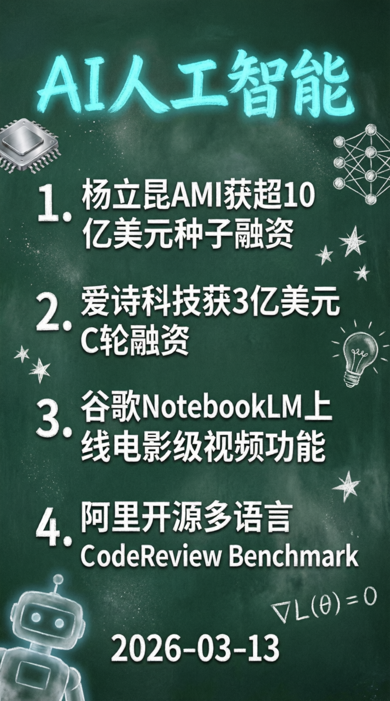
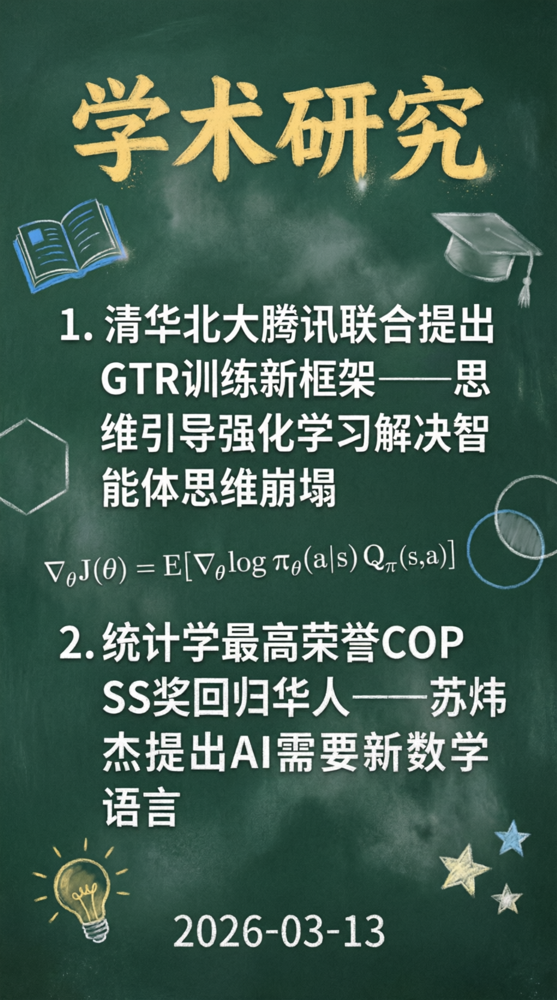

# 每日新闻精选 - 2026-03-13

> 收集时间：2026-03-13 18:15 | RSS源：185个 | 有效新闻：14条

---

## 🔥 今日重点

### AI 领域

**1. 杨立昆AMI获超10亿美元种子融资**
> "深度学习三巨头"之一杨立昆联合创立的AMI完成超10亿美元种子融资，目标是构建具备持久记忆、复杂推理和行动规划能力的AI系统。
> [量子位](https://www.qbitai.com/2026/03/387734.html)

**2. AI视频新独角兽爱诗科技获3亿美元C轮融资**
> 国内AI视频创业公司爱诗科技完成3亿美元C轮融资（约20.6亿元），由鼎晖香港基金等领投，正在抢跑「实时世界模型」技术。
> [机器之心](https://mp.weixin.qq.com/s?__biz=MzA3MzI4MjgzMw==&mid=2651021367&idx=1&sn=6934df588734d4ea1f12eccf40737d0b)

**3. 谷歌NotebookLM上线电影级视频概览功能**
> 融合Gemini 3、Nano Banana Pro和Veo 3等模型，可自动生成定制化沉浸式视频讲解，科普视频领域迎来变革。
> [机器之心](https://mp.weixin.qq.com/s?__biz=MzA3MzI4MjgzMw==&mid=2651021367&idx=2&sn=08e63953264aa59b4e919e3de9a62465)

**4. 阿里开源业界首个多语言CodeReview Benchmark**
> 阿里集团联合南京大学开源多语言、具备存储库上下文感知的CodeReview Benchmark，汇聚80多位资深工程师多轮交叉标注。
> [阿里技术](https://mp.weixin.qq.com/s?__biz=Mzg4NTczNzg2OA==&mid=2247509195&idx=1&sn=612b82d4bc6b1bca8610e4284b0f6151)

---

### 学术研究

**1. 清华北大腾讯联合提出GTR训练新框架**
> 思维引导的强化学习框架，通过自动化修正器优化模型思路，解决多模态智能体"思维崩塌"问题。
> [机器之心](https://mp.weixin.qq.com/s?__biz=MzA3MzI4MjgzMw==&mid=2651021367&idx=3&sn=b7b35b16e17903e153208b3dbe638c74)

**2. 统计学最高荣誉回归华人！苏炜杰获COPSS奖**
> 华人学者苏炜杰获得统计学界最高荣誉，提出AI需要一门新的数学语言。
> [量子位](https://www.qbitai.com/2026/03/387102.html)

---

### 行业洞察

**1. OpenClaw争议：神器还是割韭菜？**
> 业内开始质疑OpenClaw的实际价值：日耗上千、实用性有限、安全风险等问题凸显，需理性看待AI Agent热潮。
> [阿虚同学](https://mp.weixin.qq.com/s?__biz=MzkxNTUwODgzNA==&mid=2247538619&idx=1&sn=d0853db23161268623686de5375337d3)

**2. 滴滴Q4业绩创新高**
> 日订单峰值超6500万单，核心平台订单量达182.4亿单，AI出行助手"小滴"支持90多个服务标签。
> [量子位](https://www.qbitai.com/2026/03/387736.html)

---

## 🖼️ 分类图片

### AI 领域

### 学术研究

---

## 📊 今日数据统计

| 分类 | 数量 | 占比 |
|------|------|------|
| AI | 11 | 78.6% |
| 其他 | 3 | 21.4% |
| 政策/通知 | 0 | 0% |
| 遥感 | 0 | 0% |
| 无人机 | 0 | 0% |
| 测绘地理信息 | 0 | 0% |

---

## 📝 简评

今日新闻以 **AI融资和技术突破** 为主旋律：

- **融资热潮**：杨立昆AMI（10亿美元）、爱诗科技（3亿美元）两笔重磅融资，显示资本对AI基础研究和视频生成领域的长期看好
- **技术进展**：谷歌NotebookLM视频功能、阿里CodeReview Benchmark开源、GTR训练框架，推动AI实用化进程
- **理性声音**：OpenClaw争议文章引发思考，提醒行业回归产品价值本质

---

*本文由AI自动整理生成，如有错误请以原文为准。*