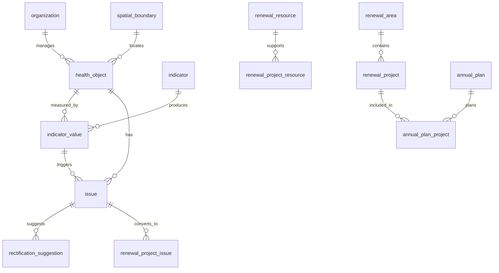

# 城市体检更新平台对象库数据库设计

## 设计依据

- `docs/superpowers/specs/2026-06-03-城市体检更新平台-design.md`
- `docs/superpowers/plans/2026-06-03-城市体检更新平台-implementation-plan.md`
- `myk/调研笔记/城市更新政策研究/住建部2025年城市体检工作手册.md`
- `myk/调研笔记/城市更新政策研究/邯郸市2026年城市体检和县城体检工作方案.md`
- `myk/调研笔记/城市更新政策研究/城市更新历史数据盘点清单模板.md`
- `myk/项目文档/城市体检评估与城市更新-地理信息与信息化行动方案.md`

## 一、总体结论

各对象库不建议做成彼此割裂的物理数据库，而应在 `PostgreSQL + PostGIS` 下采用：

```text
一套空间对象底座 + 多个专题对象库 + 问题/项目闭环业务库 + 指标版本库 + 数据资产元数据表
```

核心业务链路：

```text
对象 → 指标 → 问题 → 建议 → 资源 → 项目 → 计划 → 实施 → 成效
```

政策闭环：

```text
体检发现问题 → 更新解决问题 → 项目资金衔接 → 实施成效评估 → 年度滚动复检
```

## 二、物理 Schema 建议

| Schema | 作用 |
|---|---|
| `base` | 组织、用户、字典、行政区划、数据源、附件 |
| `geo` | 空间边界、图层、空间关系 |
| `health` | 四级体检对象、指标、体检结果 |
| `asset` | 建筑、人口、设施、管网、历史文化资源 |
| `issue` | 问题台账、整治建议、整改流转 |
| `renewal` | 更新资源、更新片区、项目库、年度计划 |
| `report` | 报告模板、导出任务、报送包 |

## 三、核心关系模型



## 四、基础支撑表

### `base.organization`

承载 `行政区 → 街道 → 社区 → 小区` 层级。

| 字段 | 类型 | 说明 |
|---|---|---|
| `id` | uuid | 主键 |
| `parentId` | uuid | 上级组织 |
| `orgCode` | varchar | 组织编码 |
| `orgName` | varchar | 名称 |
| `orgType` | enum | city/district/street/community/department |
| `administrativeCode` | varchar | 行政区划代码 |
| `spatialBoundaryId` | uuid | 空间边界 |
| `status` | enum | active/inactive |

### `geo.spatial_boundary`

所有对象库的空间底座。

| 字段 | 类型 | 说明 |
|---|---|---|
| `id` | uuid | 主键 |
| `boundaryCode` | varchar | 边界编码 |
| `boundaryName` | varchar | 边界名称 |
| `boundaryType` | enum | city/district/street/community/block/building/parcel/renewalArea |
| `geom` | geometry | PostGIS 几何 |
| `centroid` | geometry(Point) | 中心点 |
| `area` | numeric | 面积 |
| `sourceType` | enum | shp/geojson/manual/remoteSensing/planning |
| `sourceId` | uuid | 数据源 |
| `validFrom` | date | 生效时间 |
| `validTo` | date | 失效时间 |
| `version` | int | 版本 |

### `base.data_source`

记录国土空间规划、基础测绘、地下管线、房产测绘、遥感影像、历史建筑、项目档案等数据来源。

| 字段 | 类型 | 说明 |
|---|---|---|
| `id` | uuid | 主键 |
| `sourceName` | varchar | 数据源名称 |
| `sourceCategory` | enum | planning/survey/pipeline/realEstate/remoteSensing/project/archive/manual |
| `providerOrgId` | uuid | 提供部门 |
| `dataFormat` | varchar | shp/geojson/xlsx/csv/pdf/api |
| `spatialReference` | varchar | 坐标系 |
| `updateCycle` | varchar | 更新周期 |
| `qualityLevel` | enum | high/medium/low/unknown |

## 五、四级体检对象库

政策明确四级对象：

```text
住房 → 小区（社区） → 街区 → 城区（城市）
```

### `health.health_object`

统一体检对象主表。

| 字段 | 类型 | 说明 |
|---|---|---|
| `id` | uuid | 主键 |
| `objectCode` | varchar | 统一对象编码 |
| `objectName` | varchar | 对象名称 |
| `objectType` | enum | housing/community/block/city/renewalArea |
| `parentId` | uuid | 上级对象 |
| `orgId` | uuid | 所属组织 |
| `spatialBoundaryId` | uuid | 空间边界 |
| `inspectionYear` | int | 体检年份 |
| `status` | enum | active/merged/split/removed |
| `sourceId` | uuid | 数据源 |
| `validFrom` | date | 生效日期 |
| `validTo` | date | 失效日期 |
| `version` | int | 版本 |

对象编码建议：`城市代码-对象类型-年份-序号`，如 `130400-BLOCK-2026-0001`。

### `health.object_relation`

处理街区不等于街道、更新片区跨社区/街道、对象拆分合并等关系。

| 字段 | 类型 | 说明 |
|---|---|---|
| `id` | uuid | 主键 |
| `sourceObjectId` | uuid | 源对象 |
| `targetObjectId` | uuid | 目标对象 |
| `relationType` | enum | contains/overlaps/adjacent/replacedBy/splitFrom/mergedFrom |
| `areaRatio` | numeric | 空间重叠比例 |
| `validFrom` | date | 生效时间 |
| `validTo` | date | 失效时间 |

## 六、专题对象库

### 建筑/住房库

核心表：

- `asset.building`
- `asset.residential_building_profile`

重点字段：

- `buildYear`
- `structureType`
- `floorCount`
- `buildingArea`
- `usageType`
- `ownershipType`
- `hasStructuralRisk`
- `hasGasRisk`
- `isNonSuiteHousing`
- `isPrecastSlabMasonry`
- `needsAgingFriendlyRetrofit`
- `needsEnergyRetrofit`
- `needsDigitalRetrofit`

对应政策术语：`存在结构安全隐患的住宅数量（栋）`、`存在燃气安全隐患的住宅数量（栋）`、`1980年（含）以前建成且未进行加固的城市住宅数量（栋）`、`非成套住宅数量（套）`。

### 小区/社区库

核心表：

- `asset.residential_quarter`
- `asset.community_facility`
- `asset.community_service_coverage`

重点字段：

- `householdCount`
- `residentCount`
- `buildingCount`
- `propertyManagementStatus`
- `isOldResidentialQuarter`
- `facilityType`
- `serviceCapacity`
- `standardCapacity`
- `gapValue`

对应政策术语：养老、托育、幼儿园、停车泊位、充电桩、公共活动场地、步行道、生活垃圾分类、物业管理、智慧化改造。

### 街区库

核心表：

- `asset.street_block_profile`
- `asset.old_area`

重点字段：

- `populationSize`
- `landArea`
- `residentialArea`
- `industrialArea`
- `commercialArea`
- `publicServiceScore`
- `transportScore`
- `greenSpaceScore`
- `renewalPotentialLevel`

对应政策术语：老旧商业街区、老旧厂区、老旧生活街区、低效工业用地。

### 城区/城市库

核心表：

- `asset.city_built_up_area`
- `asset.city_safety_resilience_profile`

重点字段：

- `builtUpArea`
- `roadNetworkDensity`
- `greenwayCoverageRate`
- `emergencyShelterAreaPerCapita`
- `dangerousBridgeCount`
- `oldGasPipelineRenovationRate`
- `fireStationCoverageRate`
- `pipelineSmartMonitoringRate`

## 七、指标库

核心表：

- `health.indicator`
- `health.indicator_version`
- `health.indicator_formula`
- `health.indicator_threshold`
- `health.indicator_value`
- `health.indicator_issue_mapping`

字段重点：

- `indicatorCode`
- `indicatorName`
- `dimension`
- `category`
- `formula`
- `threshold`
- `dataSourceId`
- `inspectionYear`
- `version`
- `effectiveFrom`
- `effectiveTo`

邯郸本地指标体系可按 `55 个基础指标 + 6 个河北省特色指标 + 8 个邯郸市特色指标` 建版本。

## 八、问题清单与整治建议库

### `issue.issue`

| 字段 | 类型 | 说明 |
|---|---|---|
| `id` | uuid | 主键 |
| `issueCode` | varchar | 问题编码 |
| `issueName` | varchar | 问题名称 |
| `issueCategory` | enum | safety/livelihood/facility/spaceEfficiency/culture/pipeline |
| `severity` | enum | low/medium/high/critical |
| `governanceDifficulty` | enum | easy/normal/hard |
| `resolutionType` | enum | 限时解决/尽力解决 |
| `sourceType` | enum | indicator/manual/survey/specialInspection/publicFeedback |
| `sourceIndicatorValueId` | uuid | 来源指标结果 |
| `relatedObjectId` | uuid | 关联对象 |
| `spatialBoundaryId` | uuid | 问题位置 |
| `status` | enum | draft/reported/confirmed/assigned/rectifying/review/closed/recheckRequired |

### `issue.rectification_suggestion`

| 字段 | 类型 | 说明 |
|---|---|---|
| `id` | uuid | 主键 |
| `issueId` | uuid | 问题 |
| `suggestionContent` | text | 整治建议 |
| `rectificationArea` | varchar | 整治区域 |
| `rectificationType` | varchar | 整治类型 |
| `responsibleOrgId` | uuid | 责任单位 |
| `priority` | enum | low/medium/high |
| `deadline` | date | 完成期限 |
| `includedInNextAnnualPlan` | boolean | 是否纳入下一年度计划 |
| `status` | enum | draft/approved/convertedToProject/closed |

## 九、城市更新资源库与项目库

### `renewal.renewal_resource`

资源类型包括：危旧房、非成套住房、老旧小区、城中村、老旧街区、老旧厂区、低效用地、闲置空间、历史建筑、工业遗产、公共空间、地下空间、地下管网、基础设施短板等。

重点字段：

- `resourceCode`
- `resourceName`
- `resourceType`
- `relatedObjectId`
- `relatedIssueId`
- `renewalAreaId`
- `spatialBoundaryId`
- `currentUse`
- `plannedUse`
- `ownershipType`
- `landArea`
- `buildingArea`
- `safetyRiskLevel`
- `potentialLevel`
- `reuseValue`

### `renewal.renewal_area`

重点更新片区不应只作为项目属性，应独立建模。

重点字段：

- `areaCode`
- `areaName`
- `areaType`
- `spatialBoundaryId`
- `dominantProblem`
- `resourcePotentialLevel`
- `stakeholderWillingnessLevel`
- `planningGuidance`
- `status`

### `renewal.renewal_project`

支持问题转项目、资源转项目、片区转项目。

重点字段：

- `projectCode`
- `projectName`
- `projectType`
- `sourceType`
- `renewalAreaId`
- `spatialBoundaryId`
- `estimatedInvestment`
- `priorityScore`
- `responsibleOrgId`
- `implementationStatus`
- `startDate`
- `endDate`

项目与问题、资源建议用中间表：

- `renewal.renewal_project_issue`
- `renewal.renewal_project_resource`

## 十、年度计划与成效评估

核心表：

- `renewal.annual_plan`
- `renewal.annual_plan_project`
- `renewal.funding_application`
- `renewal.effect_evaluation`

重点支持：年度实施计划、资金申报、项目实施监管、整改销号、成效评估、年度复检。

## 十一、关键设计原则

1. **统一对象编码**：四级体检对象、更新资源、项目都必须编码。
2. **空间优先**：所有可落图对象统一关联 `geo.spatial_boundary`。
3. **年度版本化**：指标、边界、对象、问题、项目均需保留年度版本。
4. **问题闭环**：指标结果必须能追溯到问题，问题必须能流转到建议、资源和项目。
5. **资源独立建模**：城市更新资源不是项目备注，而是项目生成的前置资产。
6. **片区独立建模**：重点更新片区是空间治理单元，不应仅挂在项目表上。
7. **政策字段可配置**：指标、阈值、整治建议模板应配置化，适配国家、省、市、县区差异。

## 十二、优先建表顺序

1. `base.organization`
2. `geo.spatial_boundary`
3. `base.data_source`
4. `health.health_object`
5. `health.object_relation`
6. `health.indicator*`
7. `asset.building` / `asset.residential_quarter` / `asset.community_facility`
8. `issue.issue`
9. `issue.rectification_suggestion`
10. `renewal.renewal_resource`
11. `renewal.renewal_area`
12. `renewal.renewal_project`
13. `renewal.annual_plan`
14. `report.report_template` / `report.export_job` / `report.submission_package`
